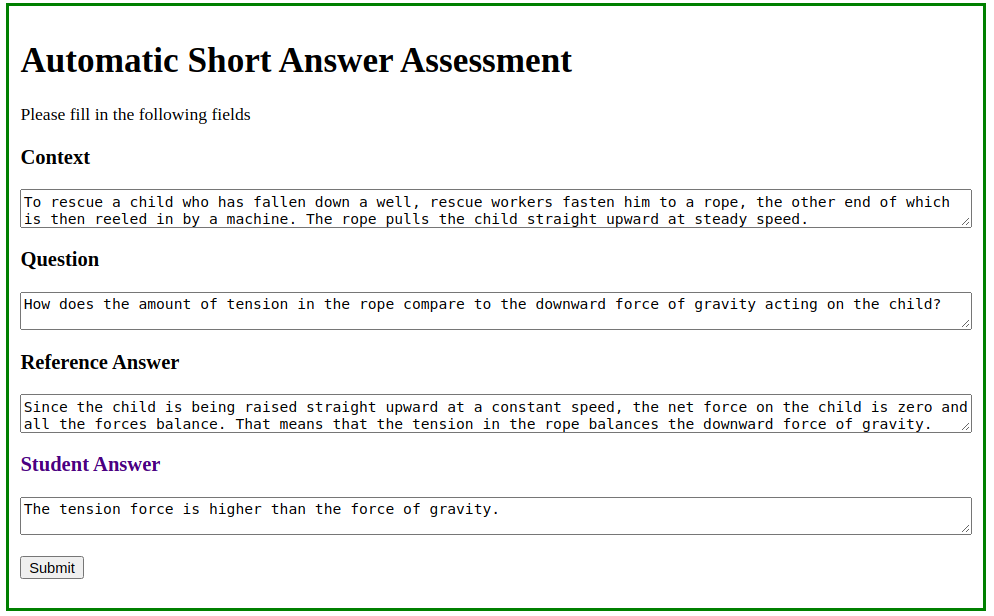
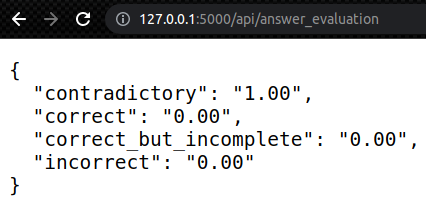

# Using Transformers for Automatic Assessment of Short Answer Grading

## Introduction
Short-answered questions require students to freely answer their thoughts as opposed to
multiple choice questions. This type of assessment may be considered as an accurate
assessment because it reveals a real student’s understanding. Nevertheless, grading short-
answered questions is extremely challenging because manual experts grading process becomes
extraordinarily expensive to scale up. To resolve this scalability challenge, we expect you to
build an automated grading system.


For this, we investigate an annotated dataset consists of 900 students’ short
constructed answers and their correctness in the given context. Four qualitative levels of
correctness are defined, correct, correct-but-incomplete, contradictory and Incorrect.[[1](#references)]


The goal of this project is to take a question, reference answers and a student’s response and determine whether the student’s response is correct, correct-but-incomplete, contradictory and Incorrect.

## Installation
To make sure the whole requirements are met for running the project files properly, first you need to make sure that conda is ready, after that:

```bash
conda create -n transformers-answer-assessment -y  # Creates a conda env
conda activate transformers-answer-assessment  # Activate your conda environment

conda install python==3.9 -y # install python version

# Make sure pytorch is installed in the env before installing the requirements.txt
conda install pytorch torchvision torchaudio cudatoolkit=11.3 -c pytorch
pip -r requirements.txt
```


## Structure

The project is explanatory, providing a simple implementation of the solution of the problem defined in the [Introduction](#introduction)
The structure of set as such:

```
[project_root]
├── data
│   ├── README.md
│   └── # [here grade_data.xml should be placed]
├── api
│   ├── templates
|   |   └── qa-input-form.html
│   └── short_answer_eval_service.py
├── utils.py
├── config.json
├── BERT-for-student-short-answers-assessment-distilbert.ipynb
├── BERT-for-student-short-answers-assessment-distilroberta.ipynb
..
```

- [api](api) The director where api endpoints are manages such as `short_answer_eval_service`.
- [data](data) Raw and processed data go here. The `grade_data.xml` file should be placed here.
- [config.json](config.json) A simple configuration to facilitate the control of data and model flow.
- [requirements.txt](requirements.txt) The famous requirements file.
- [utils.py](utils.py) General utility functions e.g. pre-processing, formatting, loading.
- Notebook files (`student-short-answers-assessment-[model_name].ipynb`) contain walkthrough guide for the steps taken to complete the solution.
- Notebook file (`inference_example.ipynb`) gives an example of how would the model work during the inference.


And to navigate to one of the GUI of jupyter
```
jupyter notebook
```


## Literature review
Banjade et al. [[1](#references)] introduced the problem, and collected a dataset.
They also developed a baseline for the problem based upon an Alignment base similarity and word weighting approach.
Later on, Condor et al. [[3](#references)] trained BERT model, 
Ghavidel et al. [[2](#references)] conducted a transformer-based approach to solve the problem but for different dataset, and compared between BERT and XLNET and have shown a noticeable performance improvement. They discussed different types of metrics during the evaluation.
Khayi et al. [[4](#references), [5](#references)] compared different transformer architectures, early transformers such as  BERT, RoBERTa, T5, ALBERT, DistilBERT, and shown that T5 was the best performing model for this task.
In [[5](#references)] a siamese network is used, to take two inputs; the reference answer and the studen't answer and feed them into two parallel networks, applying positional encoding to them before the final classification.

## Method
In this work, we build on top of the work of Condor et al. [[3](#references)]. We finetune common pre-trained transformer models such as 
`DistilBERT` and `DistilRoBERTa` as the distilled/lightweight version of BERT and RoBERTa respectively.

### Pre-processing
The basic idea is to concatenate what we call `contextual body`
which is constructed as following:
> _{context}_ [SEP] _{question}_ [SEP] _{reference_answer}_ [SEP] _{student_answer}_

This way, we can exploit the contextual ability of the transformers,
and also any kind of co-referencing that might occur shouldn't be irrelevant.
Using such pre-processing step, we have basically converted the problem into a simple classification where we input _context_, _question_, _reference_answer_
and _student_answer_ and classify the correctness of the _student_answer_. The classes are the same as defined by Banjade et al. [[1](#references)]:

```
["correct", "correct_but_incomplete", "contradictory", "incorrect"]
```


## Results
The evaluation is done according to basic metrics such as Accuracy, Precision, Recall, F-1 score.
And also AUC curves were drawn for each individual class. Training/test class-balanced splits were done according to the ratio 80/20.
The training was conducted at the same set of hyper-parameters for 4 epochs each.

### DistilBERT
For detailed resuolts, please check the [DistilBERT walkthrough notebook](student-short-answers-assessment-distilbert.ipynb) 

> Accuracy: **0.954**\
> Macro F1: **0.952**\
> Weighted F1: **0.954**

### DistilRoBERTa
For detailed resuolts, please check the [DistilRoBERTa walkthrough notebook](student-short-answers-assessment-distilroberta.ipynb) 

> Accuracy: **0.954**\
> Macro F1: **0.950**\
> Weighted F1: **0.954**


## Service API
After training and saving the model, the best model (the last in our assumption) is set ready and updated in the [config.json](config.json)

### Endpoint
A simple imaginary endpoint is added, in which the model and its preprocessing and post-processing functionalities are set ready in advance to eliminate the boot-up overhead per request.
It's totally up to the use case on how will the serve look like, and which technology is better for it to use and on which framework.
And we should pay attention to the status of it using monitoring solutions. Because it is important to know the behaviour of the model after the deployment.

### Usage
For starting the service, either form the IDE runner, or via the command 

```bash
python ./api/short_answer_eval_service.py
```

Making sure the server is up and running, basic per-sentence query is shown below:

```shell
http://127.0.0.1:5000/api/answer_evaluation
```

The pre-trained model of this work are publicly available in HuggingFace Hub

> Giyaseddin/distilbert-base-uncased-finetuned-short-answer-assessment

> Giyaseddin/distilroberta-base-finetuned-short-answer-assessment

instead of training new model, you can directly use the ones published.
After that you can replace the model name `best_model_path` in the [config.json](config.json) file.


When you visit the URl above, you should see the following layout:



Here is a screenshot for a sample output of the service:




## Next steps
### 1. Hyper-parameter fine-tuning
In the implemented models there were fixed hyper-parameters. but the actual fine-tuning process would consume much more time and computation resources. For such number of training data, a better fit could be expected if more hyperparameter combinations were experimented.
### 2. Data Augmentation
The so far collected data might or might not be sufficient for data-hungry model. Exploiting the technique to expand the human-annotated (gold-truth) data is useful. Augmentation rules don't need to be very complex, synonym replacement for instance would give a good result.
### 3. Domain specific representations
Even though large language models have a good ability in generalizing in domain specific tasks with a reasonable cost, It's becoming shared knowledge that using language models that are pre-trained or fine-tuned on the data coming from the same source of the downstream task. 
So, one suggestion here is to fine-tune big models such as BERT, XLM-roberta etc. on domain specific corpuses, and utilize the resulting model for the tasks such as NER, sequence classification etc.


## References
1. Banjade, R., Maharjan, N., Niraula, N. B., Gautam, D., Samei, B., & Rus, V. (2016, June). Evaluation dataset (DT-Grade) and word weighting approach towards constructed short answers assessment in tutorial dialogue context. In Proceedings of the 11th workshop on innovative use of nlp for building educational applications (pp. 182-187).
2. Condor, A. (2020, July). Exploring Automatic Short Answer Grading as a Tool to Assist in Human Rating. In International Conference on Artificial Intelligence in Education (pp. 74-79). Springer, Cham.
3. Ghavidel, H. A., Zouaq, A., & Desmarais, M. C. (2020). Using BERT and XLNET for the Automatic Short Answer Grading Task. In CSEDU (1) (pp. 58-67).
4. Khayi, N. A., Rus, V., & Tamang, L. (2021, April). Towards Improving Open Student Answer Assessment using Pretrained Transformers. In The International FLAIRS Conference Proceedings (Vol. 34).
5. Khayi, N. A. (2021). Advancement Auto-Assessment of Students' Knowledge States from Natural Language Input (Doctoral dissertation, The University of Memphis).
